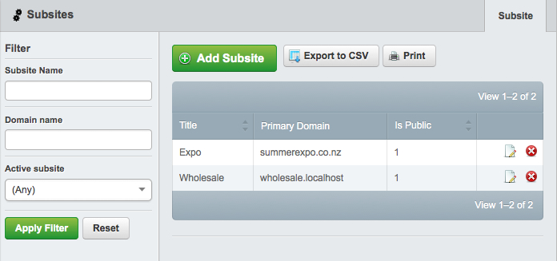
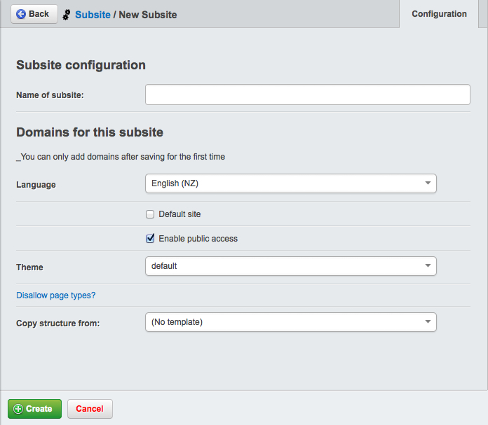
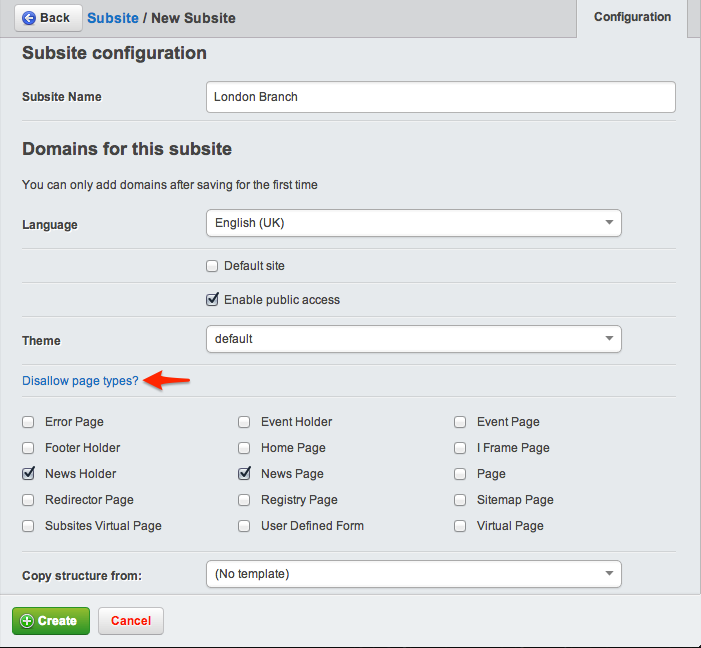
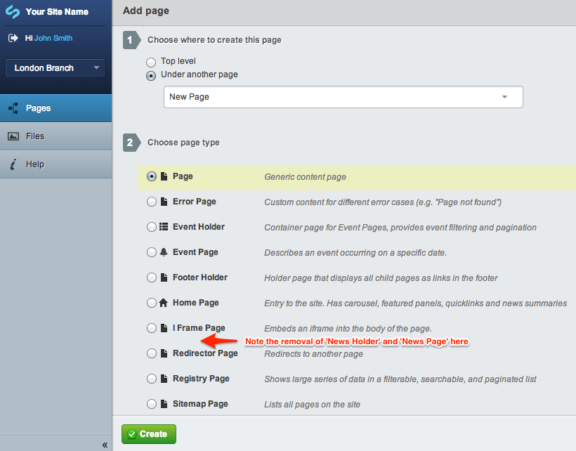

# Setting up

## Creating subsites

To view, edit and create subsites, go to the *Subsite* section of the CMS. Click *Search* to view a list of all
existing subsites.

Click on a subsite name to edit its details. Click the red X to delete a subsite (you will be asked for confirmation.)
To create a new subsite, click *Add Subsite*. This opens the *Subsite configuration* subsection.

You can configure the following details for a subsite:

 * *Name of subsite:* This is the display name for the site in the CMS (not public-facing)
 * *Domains for this subsite:* Lets you add one or more domains for this subsite, e.g., subsite.co.nz, subsite.org.nz,
subsite.com
 * *Language:* Sets the language for the subsite. This affects the spellchecker (not the CMS interface language)
 * *Default site:* If your site is accessed by a domain not listed in any subsites, this subsite is shown as default.
 * *Enable public access:* Enables/disables the subsite. Corresponds to the *Active Subsite* column.
 * *Theme:* Shows the list of available themes that exist in the themes directory. The subsite will use the templates
and styles from the selected theme.
 * *Disallow page types:* Lets you mark some page types to prevent being used within this subsite.
 * *Copy structure from:* Gives you the option to select an existing subsite from which to copy pages and files (see
 "Copying subsites" for more information about this)

## Roles

When creating roles, you can assign the following subsite-specific permissions:

 * *Access to 'Subsites' section:* Shows the *Subsite* section in the CMS, allowing you to manage subsites for your
site (ie, create, edit, view.)
 * *Manage subsites for groups:* Ability to limit the permissions for a group to one or more subsites.
 * *Manage assets for subsites:* Ability to select the subsite to which an asset folder belongs (also requires access to
*Files* section)

## Groups

Groups can have access to all sites, or to one or more specific subsites. If you have different staff in charge of each
subsite, you probably want to create a separate group for each subsite.

The dropdown in the upper left corner of the CMS indicates which subsite you are currently on. 

Once you make a selection from the dropdown, you see the appropriate groups in the *Security* section. In the Security section, click a group and go to its *Subsites* tab to assign the subsites to which the group has access. Click *Only
these subsites* to reveal a checklist of all available sites.

## Copying subsites
Duplicating subsites can be useful if you want to create several subsites based on the same general site structure. You can set up a collection of pages, files, and images and use it as a template. When you create a new subsite, instead of starting from scratch you can copy it all from your existing subsite. This will copy all pages, files and images from that subsite into your new subsite.

To create a new subsite template, create a new subsite described above under "Creating subsites" but don't add any domains. Add a name that will make it easy to see that it is a template. Select the new template from the subsites dropdown in the upper right and create the pages and add the files and images you'd like to become part of the
template.

When you create a new subsite, you can now choose to Copy structure from your template. All your pages, files and images will be copied over to your new subsite.

## Disable particular page types from a subsite
Sometimes, you will have two or more websites that are very similar, but have some small differences. For example, a head office and its 3 satellite offices may have 4 subsites, but only the head office site will have a "Company News" section on the site. In this instance, you can still use the subsites module, and use the 'Disallow page types' ability to remove certain page types from being created on subsites.

1. Create a new subsite as you normally would via the Subsites section in the CMS
2. Edit your new subsite.
3. At the bottom of the section, click on the link named "Disallow page types?" This will reveal a series of checkboxes containing all of the presently defined pagetypes in the CMS.
4. Select the page types that you wish to forbid from this subsite.
5. Click the Save button at the bottom of the section.

Note that this process is exactly the same when editing an existing subsite, you just select the subsite you want to remove page types from instead of creating a new subsite.

Now, whenever someone wants to create a new page on the subsite (the 'London Branch' subsite in this case), they will not be able to select the page types you've selected, as you can see below. Note that this restriction doesn't affect users or groups with "full administrative rights", and the blacklist will only apply to members of specified groups and users without this permission. Admins needs to login to the subsite domain directly (e.g. http://london.site.com/admin/, not http://site.com/admin). 

The page type blacklist applies only to future pages, not existing ones. If an administrator blacklists a defined page type on a subsite, existing pages of that type will remain on the subsite. The administrator (or another user) can later change it to a type that is not blacklisted after the page is published; however, once a user does that, that "grandfathered" pagetype will no longer be available to the published page.

For example, say a subsite user publishes a new Company Page before it was forbidden by an administrator. Later, a user with full administrative rights decides to disallow Company Pages from being created on the subsite. This restriction will only apply to all future pages that are published, but not to existing Company Pages. The full administrator (or any user with sufficient publishing rights) will have to manually convert any published Company Pages on the subsite to that of another allowed type.